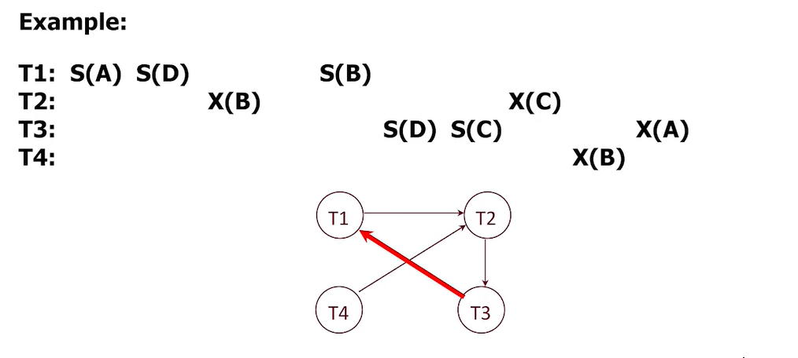

# bustub 小型关系型数据库内核

## Proj2 B+树索引
- 注意：实现的索引中，叶子结点会指向对应记录的磁盘地址。这与 MySQL InnoDB 引擎是有所不同的。在 MySQL InnoDB 的索引中，主键(ID)索引的B+树叶子结点直接挂着记录的具体数据，这也被成为“B+树文件组织”结构。

**难点1**
- B+ 树本身逻辑复杂，既要考虑叶子结点，又考虑树结点，结点的分裂、合并、根的转换等十分复杂。但是，不必严格按照教材算法实现，多看几个动态插入、删除的图解，然后凭感觉和逻辑就可以把B+树的增删改查写出来。
- [待填充：描述B+TREE的插入]
- [待填充：描述B+TREE的删除]

**难点2**
- 实现线程安全的、支持并发的B+树。此时，你需要用到 PageGuard 自动释放读锁，自动取消钉住页面。加锁算法：① 对于查找操作，子结点上锁之后，可立即释放双亲结点的锁；② 插入操作，子结点上锁且未满，(从而分裂不会影响到它的祖先)，释放所有祖先结点。③ 删除操作：对于某个内部结点 > 半满才可(注意是大于，不能等于)认为其祖先结点是安全的；对于某个叶子结点，也是 > 半满，则其祖先安全；此外，无论叶子、非叶子，对于根结点的要求低一些，满足至少有一个key(对内部结点而言，这意味着有两个孩子指针)即可。
- 虽然乐观锁也可以实现且性能更好，但其实现显然在本人能力范围之外。
- 非常值得注意的是，有了 page_guard 虽然能够保护B+树的页，但是它无法保护那个十分**的数据：root_page_id_。在更新 root 的时候，必须要保证 B+ TREE root_page_id_ 和 新产生或新成为 ROOT 的页的 page_id 是同步变化的。并且在此期间，不可访问 root_page_id_，此外，也有可能读取到旧的 page_id，所以可能需要尝试使用乐观锁。

**难点3**
- 控制Evict策略，及时取消钉住页面，防止缓存池爆满带来的下面的各种BUG。
- 这通过 PageGurad 和加锁统一管理即可。自动释放资源比手动释放友好很多，也更应该使用，这就是 C++ RAII ，即通过一个对象的生命周期管理堆内存的资源。

**Bug1 数组越界带来的未知行为：[此处是数组越界导致其后的字段page_id_部分覆盖，从而 page 无法释放]**
- 由于数组越界导致 page_id 发生了改变。而数组越界是由于叶子的深度没有上限控制，为什么叶子的上限会超过3？
- 因为在原来的实现中，叶子结点分裂分两步，先插入新结点，使得叶子结点溢出；然后再一分为二。如果叶子结点插入溢出之后，发现缓冲池是满的，无法
分裂，函数就直接返回了，叶子结点会持续处于溢出状态，并且溢出之后 IsFull 会返回 false(IsFull 采用等号判断)，使得阶为3的叶子结点也能插入245个(key, value)键值对。如果 buffer_pool 较小，叶子结点最终会溢出而无法分裂，溢出会导致数组越界，Page 的 page_id_ 会被部分覆盖写入，从而导致Pageguard在释放这个页时无法匹配原来的 page_id_[可扩展哈希表查找失败]，释放失败，这个页就会长期驻留在缓冲池中。

- 为什么buffer_pool较小而数据规模scale较大时，会直接卡死？比如 size = 30 的 buffer_pool，B+ 树的 n(阶)保持最大(245)，插入 1000 个数据会在 9452 左右卡死？
- 直接卡死是因为缓冲池满了，没有可驱逐的页面，无法从磁盘中读入新的页面了，程序无法向下运行。
- size = 30 的缓冲池是够用的，并不是不够，因为B+树，特别是240+阶的B+树，深度不会超过5，递归调用不会过多。之所以缓冲池会逐步变满导致卡死，是因为：245深度的叶子结点，如果采用“先插入(从而导致页溢出，会占用其它未知内存)，再分裂”的方式，会导致这个短时间溢出的叶子结点的page_id_发生变化(内存溢出，覆盖写入page_id_)，从而Pageguard在释放这个页时无法匹配原来的 page_id_，pin_count_ 无法减到0，这个页会长期驻留在缓冲池中。这会导致缓冲池的空间越来越小，最终填满整个缓冲池。

- 缓冲池相对于插入的结点数量而言过小会导致哪些问题？
- 因为buffer_pool较小，会导插入结点后分裂失败(前提是采用先插入[会有一段时间溢出]，后分裂)(不能获取到新的page)，导致数组越界(本来希望最多存俩key，结果存了253个key)[注意：这种情况由查找算法也不会找到插入的那些数据]，数组越界就会修改其后面 page_id_ 的数值。page_id_ 改变会导致页面释放失败，从而 buffer_pool 很快会被占满，内存无法及时得到释放，(以 key == 3 为例)即本次 Insert 之后，叶子结点大小变成 3，之后变成 4 ...(IsFull仅对等于keynum==2的情况生效)

- 解决方案：① 从根本上，应该防止数组越界，防止任何页出现短暂的“溢出”，从而防止页面无法被及时释放。② 及时 EVICT 不需要的页面，当然这使用 PageGuard 进行保护即可。② 用户输入的 size，你在构造函数里×2，“预留空间”，比如 pool_size = 2 * size，将缓冲池内部设置的比较大即可，但这只是权宜之计，不是什么好办法，因为程序本身就有问题。

**Bug2 PageGuard本身存在的Bug**
- 等号构造时要先舍弃自己的资源，然后才能接收别人的资源。
```C++
auto operator=(ReadPageGuard &&that) noexcept -> ReadPageGuard & {
    if (this == &that) {
      return *this;
    }
    //! \bug 注意：一定要先放弃当前拥有的资源！
    Drop();                         
    guard_ = std::move(that.guard_);  // 等号赋值转移所有权，这可以保证锁的状态是不变的。
    return *this;
  }
```
- 防止一个锁或者一个资源被释放两次。

**Bug3 B+树实现本身的BUG**
- 比如左右兄弟写错、交换或借入的结点不对等各类问题。但幸好该实验提供了B+树可视化工具，方便调试。

**项目优化的一些要点**
- 从 LaderBoard 的排名来看，二分查找带来的效率提升功不可没。在实现时，所有查找操作，包括查找插入位置，皆使用二分查找。
- 此外，root_page_id_ 和 root_page 的变换是难以维护的，我也写不对。所以应该采用一个比较明智的策略，正如我们在leetcode上处理链表头结点时，往往添加一个哑结点，B+树为了更好地处理Root，可以使用一个额外的page来作为根结点的祖先，这个page只负责指向真正的根结点。然后成员变量 root_page_id_ 指向这个额外的页即可。每次直到读到根结点，并发现根结点是安全的，就释放额外的页上面的锁。比如插入操作时，根结点未满，则根是安全的；删除操作时，根结点的孩子指针个数 > 2(注意：等于2则根结点可能被合并，即此时根是不安全的) 就认为根结点是安全的，即可释放额外页。对于查找操作，读入根结点的页之后即可立即释放额外的页。如果一直持有额外的页，就相当于加大锁，[当然，还是有区别的，比如缓冲池的页还是可以及时被刷出到磁盘的]，没有什么并发性。
- 加锁原则：先安全，后高并发。可以先加粒度比较大的锁，就像 Java HashTable 那样，所有对外的方法都加大锁，先保证线程安全。然后逐步优化为细粒度锁。不要想着一步到位。

**一些八股补充？**
- 为什么 MySQL 采用 B+ TREE 索引的时候要将元组本身挂在叶子结点上？
- 一个思考：在插入或者删除元组时更容易维护。因为你只需要对叶子结点对应的这个page(16KB)进行修改。如果你在叶子结点存放磁盘地址，这在查找时没什么问题，只不过会多一次 I/O；在插入元组时，如果你每次插入在数据表文件的末尾，那么索引的先后顺序将不再代表磁盘中元组的先后顺序，如果使用B+树进行范围查询，取出一系列记录磁盘地址后，可能带来较多的随机磁盘 I/O，而随机磁盘 I/O 的效率低于 顺序磁盘IO。当然，这些是机械盘的情况，如果使用 SSD 固态盘，情况可能会有所不同。如果每次插入元组，插入在数据表文件的以主码为顺序的合适位置，(主索引始终保持聚簇)，那么每次也需要维护磁盘文件中记录的顺序以保证元组的有序性，这可能需要在数据表文件中移动较多的记录。

## Proj3 算子执行器
**准备：代码是如何组织的？**
- 假设我们执行 SELECT colA FROM __mock_table_1; 这个简单的查询。
- 核心函数：直接锁定 execution_engine.h 里面的 Execute 函数。
- const AbstractPlanNodeRef &plan 是经过了 Parser -> Binder -> Planner -> Optimizer 四个阶段产生的东西。这个 plan 打印出来的效果就是 
```
Projection { exprs=[#0.0] } | (__mock_table_1.colA:INTEGER)
  MockScan { table=__mock_table_1 } | (__mock_table_1.colA:INTEGER, __mock_table_1.colB:INTEGER)
```
- Execute 函数中包含了 auto executor = ExecutorFactory::CreateExecutor(exec_ctx, plan); 它会递归地创建算子执行器，使得它形成一颗树。在构造
子结点的时候，plan 也会做相应调整，使得子节点不可以看到父节点的 plan。plan = insert_plan->GetChildPlan()，比如以上面的 plan (子结点是 MockScan ，父结点(根结点)是Projection) 为例，两个结点的 plan_ 如下所示：
```
MockScan Executor 的 plan_ 变量是 [只有下面一行]
MockScan { table=__mock_table_1 } | (__mock_table_1.colA:INTEGER, __mock_table_1.colB:INTEGER)

Projection Executor 的 plan_ 变量是 [同时包含下面两行]
Projection { exprs=[#0.0] } | (__mock_table_1.colA:INTEGER)
  MockScan { table=__mock_table_1 } | (__mock_table_1.colA:INTEGER, __mock_table_1.colB:INTEGER)
```
- 提示：一个算子只能看到它自己及算子树中它的子结点的 plan，并且自己的 plan 永远处于最上层。
- executor->Init(); 的调用也是递归的，相当于对整个算子树的所有 executor 都进行了初始化，递归出口或许是 MockScan Executor。MockScan Executor[全表扫描算子] 的初始化是 cursor_ = 0;
- 每个算子的核心函数是 Next()，GetOutputSchema().GetColumnCount() 可以统计这个算子执行后输出的列数。因此，由于有 plan_ 变量，所以算子是知道自己输出的关系模式的。
- expr->Evaluate(&child_tuple, child_executor_->GetOutputSchema()) 通过输入子结点的计算结果计算父结点的表达式。如果执行的是  exprs=[#0.0] 或者 exprs = [(2 + 3), (4 + 5)] 则这个 expr->Evaluate 似乎会执行两次...

- values (1, 2, 'a'), (3, 4, 'b'); 这种可以直接创建一个两行，三列的表。它的执行计划如下
```
Values { rows=2 } | (__values#0.0:INTEGER, __values#0.1:INTEGER, __values#0.2:VARCHAR)
```
**顺序扫描，IndexScan的理解**
- 为什么 order by 会用到 index scan ？ 
- 因为可以这样执行：先在待排序 key 对应的 B+ 树索引中顺序扫描，按照顺序取出所有 key，随后去数据库表文件中逐个读取即可。由此就恰好按照完成
了一次排序。[并且是按照 key 的顺序]
- B+ 树的叶子结点的 value 表示其磁盘地址，或许正是我们要找的 RID，只要你有 rid，找到数据表文件的开头的磁盘地址[一般都是按照字节寻址]，经过一些偏移量的计算即可找到对应的元组。[key --> rid].
- 所以, IndexScan 的实现思路是: 先顺序扫描索引,找到一个 RID 序列(按key有序),然后再去数据表文件(table_heap_)中按照 RID 逐个把元素查找出来即可.由于表文件是按照 RID 有序的, 所以这样查询文件效率更高,并且你查到的所有元组出现的先后次序都是有序的. 如果你不经过索引,你就不得不对文件进行外部排序,或者把所有元组读入然后内排,这是不可接受的. 
- 索引扫描如下所示,所以你可以通过 index_oid (即索引的唯一标识 id) 直接定位到某个 key 索引的 B+ TREE.
```
IndexScan { index_oid=0 } | (t2.v3:INTEGER, t2.v4:INTEGER)
```
**算法：聚合函数(与去重函数)的哈希算法**
- 下面我们以计算 select student_name, avg(score) from student_score group by student_name;(计算每个学生的平均成绩)
- ① 分区：由于数据表很大，我们难以得到完全在内存中的哈希表。如果有 where 子句，那么你需要先过滤，然后再投影到仅剩 
student_name 和 score 这两列。然后，使用哈希函数，将表的记录放到 B 个桶中。这里只是一个形式上的哈希，本质上不是 HASH，
只是在分区，所以，哈希函数一般就是 f(key) = key % B 这种。注意：这个阶段的每个分区或许都需要持久化到磁盘上。
- ② rehash(再哈希)：对于上面的每个分区(提示：一个分区可能对应多个磁盘页)，你需要[再用一个其它的哈希函数]，创建一个内存中的
哈希表，完成结果汇总：[1]如果你找到了对应的分区key，那么你只需要更新汇总字段，这里就是平均成绩；[2]如果没找到，就需要向哈希表
新添加一个 [key -- 汇总字段] 这样的表项。这里，哈希冲突问题可以采用线性探测再散列的做法。注意：在聚合函数中，你的哈希表是<K, V>键值对的形式。
- ③ 每次一个分区处理完成后，你需要把这个内存中的哈希表清空，以供下一个分区使用。
- 提示：在 proj3，你无需处理 ① 分区这个步骤，你应该是只需要处理 rehash 的过程。

**聚合函数在本项目中的实现**
- 在初始化阶段将某个元组分为 group by keys + agg values 两部分，然后使用 group by keys 作为 HASH KEY，
将该元组的 agg values 更新到[比如 count 就是 + 1，sum 就是把 value 也加上]对应的 hash key 中即可。

**Join的实现：索引嵌套循环连接(NestedLoopJoin)**
- 用于处理自然连接和等值连接。
- 假设是 t 连接 s，那么 s 是右侧表，我们使用的就是右侧表的索引。比如，左侧表中拿出一个元组，ID = 2038，那么你就需要通过B+树索引到右侧表中寻找
到所有 ID = 2038 的 元组，这种做法的好处在于，你无需对于每个左侧元组，都对右侧进行一次全表扫描。(注意：B+树的叶子结点上面存放的就是 key --> RID 的键值对，所谓 RID，就是你在proj2中的磁盘地址。)
- 提示：注意：在算子树中，普通嵌套循环有两个子算子结点；而索引嵌套循环仅有左表的一个算子结点。

**经典的优化问题：sort + limit**
- 这里的思路是 HEAP SORT，具体的，你不需要使用堆排序。你只需要维护一个固定大小的优先队列即可。扫描一遍全表，维护一个优先队列(最大的元素在队尾)，即构建一个小顶堆，堆顶就是直到当前的第K大的元素，如果下一个元素比堆顶的元素更大，那么就将堆顶元素出队，新元素入队。
- 注意：这里你需要理解优化器是怎么进行优化的，通过 gdb 调试即可得知。你更应该参照 order_by_index_scan.cpp 来完成优化器。优化器的基本思路就是
如果 Limit --> Sort(child) ...，你需要将 Limit 和 Sort 合并为 TopN，如下图所示。
- 为什么这么做能够提高性能？答：TOPN算子在初始化阶段Init，遍历全表的所有元组，维护一个 TOPN 的优先队列，从而选出 TOPN 的元组，然后再逐个吐出到外部即可。在未优化的情况下，TOPN 需要对全表扫描，在内存中暂存所有元组，进行排序，然后取出前10，逐个吐出。
- MySQL 的 sort + limit 似乎就是这种未优化的 sort + limit。而为了减少内存占用，加快排序速度，可以只取 id 字段和排序字段，通过 Projection 算子获得比较小的 Tuple(仅包含两个字段)，然后进行 Sort 取 limit，得到一系列 id，再通过这些 id 去查询表格即可.
```
=== PLANNER ===
Limit { limit=10 } | (__mock_table_1.colA:INTEGER, __mock_table_1.colB:INTEGER)
  Sort { order_bys=[(Default, #0.0)] } | (__mock_table_1.colA:INTEGER, __mock_table_1.colB:INTEGER)
    Projection { exprs=[#0.0, #0.1] } | (__mock_table_1.colA:INTEGER, __mock_table_1.colB:INTEGER)
      MockScan { table=__mock_table_1 } | (__mock_table_1.colA:INTEGER, __mock_table_1.colB:INTEGER)
=== OPTIMIZER ===
TopN { n=10, order_bys=[(Default, #0.0)]} | (__mock_table_1.colA:INTEGER, __mock_table_1.colB:INTEGER)
  MockScan { table=__mock_table_1 } | (__mock_table_1.colA:INTEGER, __mock_table_1.colB:INTEGER)

提示：plan 的 children 是什么？答：把plan看作一颗树，children就是抛去根结点后剩下的子树，可能是多个 child，也可能是一个 child
比如：我有一个完美的计划 plan：
Sort { order_bys=[(Default, #0.0)] } | (t1.id:INTEGER, t1.score:INTEGER)
  Projection { exprs=[#0.0, #0.1] } 
    SeqScan { table=t1 }"
如果取 plan->GetChildren()，那么得到的子 plan 就是下方的东西。
Projection { exprs=[#0.0, #0.1] } 
  SeqScan { table=t1 }"
```

**Bug记录区**
- **① 非常好 BUG，爱来自 Proj2.** Proj2 的 root page 需要你自己分配，header page 是系统赠送的，它维护了 B+ TREE 的元信息。每次变换 root_page_id_ 的时候，你都需要执行函数 UpdateRootPageId(0) 以更新这个 HeaderPage 里面的 root_page_id_. 在你原来的实现中，直接将 header_page 本身当成了 root page，所有 tree 的 root_page_id 都是 HEADER_PAGE_ID(0)。这可能在 proj2 中不会出现问题， 但是你用相同buffer_pool_ 构建第二个树的索引时，page_id 依然从0开始，则原来第一颗树的 root page 会被覆盖，于是你获得的索引就是乱序的，甚至都无法得知访问的是哪个B+树。我都不知道proj2测试为什么能过....
- **② 神奇的错误：**
```C++
// 错误的写法
//! \note 注意：由于 DeleteEntry 第一个参数是 key，要求你传入只有一个 key 的元组 (key)，而不是整个 child 元组
index_info->index_->DeleteEntry(child_tuple, *rid, exec_ctx_->GetTransaction());

// 正确的写法
Tuple key{child_tuple.KeyFromTuple(child_executor_->GetOutputSchema(), 
                       *(index_info->index_->GetKeySchema()), index_info->index_->GetKeyAttrs())};
index_info->index_->DeleteEntry(key, *rid, exec_ctx_->GetTransaction());
```
- **③ 可恶的嵌套循环连接 Join。** 错误体现在，在左连接的时候，如果生成悬浮元组，然后调用 NextAndReset，随后函数直接返回；由于 NextAndReset 会导致右侧表的游标下移一个单位，所以会忽略右侧表的第一个元组，造成连接错误。
- **④ 索引嵌套循环连接中的错误：**
```C++
// 对于某个不能匹配的左表元组，如果是内连接，那么需要向下迭代
if (!NextAndReset()) {
  return false;
} else {
  continue; // 这里需要continue 进行下次循环！
            // 继续向下执行的话，由于 result(一个 vector) 是空，你取了 result[0] 这会直接给你 SEGMENTATION DEFAULT。
}
```
- **⑤ 构造与初始化：** 聚合函数聚合时的那个哈希表需要在 Init() 中初始化，否则你多次调用 Init()，聚合值会进行累计。
类似的问题还存在于 IndexScan 的 sorted_rids_ 数据结构，每次初始化必须清空该结构。否则元素会在里面富集。
下面的代码展示了正确的聚合函数初始化代码，并标记了 bug 所在之处。以 count 为例，如果没有 clear 那一行，将会
使得该算子每次执行 Init 的结果累计，第一次是 2， 第二次是 4，第三次是 6...
```C++
void AggregationExecutor::Init() {
    child_->Init();
    aht_.Clear(); //! \bug 每次初始化都需要清空原有汇总表，防止汇总结果每调用一次 Init 就进行一次累加
    Tuple child_tuple{};
    RID child_tuple_id{};
    // ... 下方的代码省略
}
```

**Proj3难点**
- 难点不在于写，而在于读。在对算子树和火山模型有了基本认知后，你就需要阅读它给出的代码架构，看一看一个查询究竟是如何执行的。否则写了也是错的。这可能也是在开发中接手别人的项目需要克服的难点。解决办法：使用 gdb ，输入一些查询，然后开启调试，查看程序的执行路径。gdb不仅可以调试，还可以用来读代码，这样至少能看到程序的执行路径是怎样的。

## Proj4 并发控制
### 任务一：锁管理器
- 对于两阶段锁和隔离级别，可以参考 https://blog.csdn.net/weixin_51524596/article/details/135497030
**我们如何通过两阶段锁保证读未提交、读已提交、可重复读这三种隔离级别？**
- ① 读未提交(2PL)：它就可以造成脏读。2PL：扩张阶段：逐步获取你想要的锁；收缩阶段，可以逐步释放锁,但是不允许获得锁。整个过程中，都不允许任何读锁，包括 S/IS/SIX 锁。
- ② 读已提交(S2PL)：S/IS 锁读取完成后需要立即释放(从而S/IS锁释放不会导致事务状态从扩张进入收缩)；排他锁(X/IX/SIX)，直到事务完成(commit/abort)后才释放。
- ③ 可重复读(SS2PL)：也就是扩张阶段：逐步获取你想要的锁。这些锁(同时包括共享锁和互斥锁)只有在事务结束(commit/abort)时才被释放。
- 提示：在实现事务隔离级别的地方和我们的锁管理器的实现是有一些出入的。在查询执行的时候，理论上，S2PL 和 SS2PL 应该是没有收缩阶段的。而我们的锁管理器中为 读已提交、可重复读都设置了收缩阶段，且 读已提交 还保证了 S / IS 锁的获取自由性。
- 为什么 S2PL 无法保证可重复读？答：问题主要在于读锁能随时释放。比如执行顺序：事务1(R(A) = 5) --> 事务2(X(A) A <- 7) --> 事务2改数据后提交 --> 事务1(R(A) = 7) --> 事务3(X(A) A <- 6) --> 事务3提交修改 --> 事务1(R(A) = 6)。
- 为什么 SS2PL 能够保证可重复读？答：因为读锁只有事务结束时才会释放。比如 事务1(R(A) = 5) --> 直到事务结束才能释放 A 的读锁，事务结束之前，其它人都没办法获得 A 的写锁，所以可重复读。[提示：快照读(普通的select)使用MVCC实现可重复读，它甚至可以解决幻读]
- 在没有任何锁的情况下，肯定会脏读(不考虑日志系统，假设buffer pool中的修改一定会被刷入磁盘)，比如事务1修改了 A，把它写入 BUFFER_POOL 的 PAGE 中，事务2 读取了这个记录，发现 buffer pool 中有相关 page，那么它肯定也会去 buffer pool 中读取这个 page，随后事务1回滚了，把数据改了回去，而事务 2 则造成脏读。一般而言，事务一旦提交，就会触发刷盘操作，对应的 page 会立即写入磁盘，当然，在这个项目中，不考虑数据库恢复和日志，所以 page 可能是佛系写入磁盘的。

**如何实现加锁请求的管理？**
- 一个资源可以是一张表，也可以是一行记录。
- 对每个资源维护一个队列，这个队列包含了当前所有的锁请求(授予的和未授予的)，包含事务id，请求锁的等级等。
- 遵循先来后到的原则，将新的锁请求加入该资源的锁请求队列的尾部；如果是锁升级，则将新的锁请求加入请求队列第一个未被授予的请求之前(具有优先级)。
- 然后尝试对该请求授予锁：对该锁请求前面的所有请求进行检测；如果前面的锁请求都授予了，那么考察新的锁请求和前面的锁请求是否冲突；如果前面存在未授予的锁请求，则尝试对未授予的锁请求加锁，如果发现前面的请求无法授予锁，那么该请求一定不能授予锁，故直接返回。在无冲突并且前面的锁都能授予的情况下，则对该请求授予锁，否则在该请求队列的锁和条件变量上进入等待状态。

**如何实现解锁请求的管理？**
- 注意：如果持有行锁，那么不可以解开对应表的意向锁。
- 把事务持有的锁从该资源的请求队列中移除，然后调用 notify_all 通知该队列上阻塞的事务重新尝试获取锁。

**insert/delete 是如何保证隔离级别的[你需要从全表扫描的算子角度进行分析]？**

**什么是 MVCC？**
- 提示：MySQL 的 InnoDB 引擎为了提高可重复读的执行效率，对快照读(普通的select)，采用了MVCC(多版本并发控制)，解决了幻读的问题(那么也解决了可重复读的问题)。
- MySQL 的快照读：普通 select 语句；通过 MVCC 解决可重复读、幻读问题，是不加锁的非阻塞读。
- MySQL 的当前读：select lock in share mode, select for update ; update, insert ,delete。这些操作都会使用锁管理器根据事务的隔离级别进行加锁，是本次实验将实现的部分。

**为什么MySQL的RR(Repeatable Read)解决了幻读？**
- 如果是标准SQL的隔离级别，RR是不能解决幻读的；但是MySQL的 RR 是可以的，使用的是间隙锁 GapLock ，在 RR 级别下，默认开启；在 RC 级别下是关闭的。

**我们为什么要使用2PL？**
- 因为我们需要保证多个事务的调度是可串行化调度。即调度运行的结果保证和两个事务完全串行执行是一致的。
- 但是显然，基本的2PL几乎不能保证任何隔离级别。我们依然需要隔离级别。
- (可重复读) 比如数据分析师A和程序员B并发地向数据库发起了两个事务，B在更新这个数据，A在做数据分析报告，当他查询第一次这个数值时是A，第二次查询这个数值时是B，而这是在一个事务中发生的，那么同一个数据的数值不同，会给数据分析报告带来错误。
- (读已提交) 如果事务T1更新数据，T2读取到了更新的数据(读未提交)，而T1由于某些原因回滚了，T2提交了，则T1造成的影响会泄漏出去。显然，严格两段锁协议(SS2PL)可以避免这个问题。

**带有谓词的锁**
- cv_.wait(lock, predicate) 在线程被唤醒(notify)的时候，是先尝试获得锁，然后再评估谓词，如果谓词是 false 则释放锁接着睡觉，以防止假唤醒。
- 在线程进入 wait 的时候，先评估谓词，如果谓词是 false ， 才会释放锁并将线程休眠(阻塞)。

### 任务二：死锁检测
**死锁检测的理解**
- 死锁检测是一个后台线程，从下面的代码就可以看出来，在锁管理器的构造函数中，就开启了死锁检测的线程。死锁检测任务代码是一个死循环，
每运行一次就睡会儿，然后再运行。
```C++
LockManager() {
  enable_cycle_detection_ = true;
  cycle_detection_thread_ = new std::thread(&LockManager::RunCycleDetection, this);
}
```
- 等待图：如果事务T1获得锁需要等待T2释放锁，那么就添加一条边 T1 -> T2。
- 为了理解如何构建等待图，我们看下面的例子
- 显然 T2 的 X(B) 是已经获得的锁，而 T1 S(B) 和 T4 的 X(B) 都在等待获得锁，因此存在关系：T1 -> T2, T4 -> T2
- 每次检测的时候，你需要遍历这个请求队列上所有未 granted_ 的请求，对每个未 granted_ 的请求，遍历它前面所有 granted 的请求，如果二者存在冲突(不能共存)，则绘制一个边，即 未granted -> granted 的请求。


**等待图的构建**
- 在实现的时候，我们对所有资源的锁(包含所有行级锁和表级锁)的锁请求队列进行遍历。对于单个资源的锁请求队列，顺序扫描并记录直到当前所有被授予锁的请求，在发现某个请求没有被授予锁的时候，就检查直到当前所有被授予锁的请求和这个请求是否冲突，如果冲突，就添加一条边[如果当前请求和前面被授予锁的请求有多个冲突，那么需要添加多条边]。
- **定期唤醒：**为了防止某些事务为了获取某个资源的锁而永远沉睡，只要遍历到某个资源的锁请求队列，就做一次 notify_all() 叫醒服务，让这些事务进行一次为此判定，看看是否能获取到锁了。
- **线程安全：**死锁检测一开始，首先对盛放这些锁请求队列两个map(分别是行级和表级)加锁，然后遍历到某个具体请求队列的时候，再对这个请求队列加锁，遍历这个队列结束后及时释放锁；死锁检测结束的时候，再释放这两个 map 的锁。

**检测有向图中是否有环的算法**
- ① 简单易行的算法：拓扑排序。每次寻找有向图中入度为 0 的结点，然后删除它和它的所有出边。循环往复，直到图中不存在入度为 0 的结点。如果图的剩余结点不为 0 ，那么图必定存在环。
- ② 稍显复杂的算法：DFS。这里我们只介绍连通图(因为非连通的情况下，写个 for 循环遍历每个连通的部分即可)。
```
I. 传统 DFS 是 ① 访问当前结点。② 从它的每个邻居结点(V1 -> V2/V3/V4...)出发依次进行DFS。在这个过程中，你需要记录每个结点是否被访问了，从而保证每个结点只被访问一次。
II.当你希望用 DFS 检测环的时候，需要使用回溯算法，代码框架不变，多设置一个全局变量用于记录访问结点的路径[它应该是有序集合，比如 std::vector]。每次访问结点，将该节点添加到访问路径；然后遍历邻居DFS，遍历邻居结束后，将该结点从访问路径移除。在每次从某个结点的邻居结点出发 DFS 的时候，无论这个邻居结点有没有被访问过，先检测这个邻居结点是否在访问路径中，如果存在，那就说明你绕回去了。然后在访问路径上，从这个邻居结点开始遍历，找到 txn_id 最大的那个。(提示：代码中是有问题的，它使用了无序集合，并且不是从这个“出事”的结点开始遍历的)。
```
- 正确的代码是这样的[提示：你需要把原来的 std::unordered_set<txn_id_t> node_path 更新为 std::vector<txn_id_t> node_path ]
```C++
/**
 * 该函数用于当某个邻居结点在访问路径中的时候(存在环)，找到环中 txn_id 最大的事务
 * @param node_path 访问的结点路径，是按照顺序的，比如 T0 -> [T1] -> T2 -> T3，
 * @param adj_txn_id 出事的结点，比如 T1(上面的中括号表示环的入口是 T1)，即：T0 -> T1 -> T2 -> T3 -> T1(绕回去了)
 * */
auto LockManager::FindMAXVal(const std::vector<txn_id_t> &node_path, txn_id_t adj_txn_id) -> txn_id_t {
  txn_id_t result{INVALID_TXN_ID};
  bool reach_loop{false}; // 查看是否到环了
  for (txn_id_t elem : node_path) {
    if (elem != node_path) {
      if (!reach_loop) continue;
      result = std::max(result, elem);
    } else { // 进入环
      result = std::max(result, elem);
      reach_loop = true;
    }
  }
  return result;
}
```
- 如果有环，就把环里面年轻的事务(事务 id 最大) Aborted/Rollback 了以把循环打破，然后将它涉及的所有锁请求都移除，涉及的所有锁请求队列的条件变量分别调用 notify_all()，看看其它事务能不能获得锁。

### 任务三：并发查询执行
**一些提示**
- 你需要在三种隔离级别下进行加锁、解锁等操作。
- 如果想获取表级别的锁，则需要在 Init 阶段加表锁。而在 Next() 中加行锁。
- 意向锁的释放不会影响事务的状态，因为它主要用于表明事务对某个数据结构较低级别(如行锁)的访问意图。
- 锁管理器的实现宽松且复杂,因此建议按照事务的要求来规范两阶段锁协议,即除了读未提交之外,其它的隔离级别都需要在 COMMIT/ABORT 的时候才能释放写锁。
- 实现原则：在某种隔离级别下，所有使得事务进入收缩阶段的锁都不能手动释放，(从而这些锁会在事务被Aborted/Committed之后统一释放)，因为这会导致该事务后续执行的其它查询无法再获取 X/IX/SIX 锁，导致事务失败。
- 提示：插入是真插入，即直接对磁盘的TABLE文件进行修改；而算子的删除是逻辑删除，只是把元组的某个比特位标记为删除，真正删除是在 COMMITTED 阶段，此时会对磁盘文件进行修改；如果事务 ABORTED 了，则会进行回滚，将元组的比特位恢复为未删除。
**实现要点**
1. 顺序扫描(注意：理论上只在 Init() 的时候加 S 表锁，全表扫描完成后释放 S 表锁也行，但是由于这个项目的历史原因，这似乎行不通)
- 如果事务隔离级别是读未提交，则不用加任何锁，因为在这种隔离级别下，不允许获得任何读锁。
- 如果事务隔离级别是读已提交，那么算子 Init 的时候加表意向锁(IS)，然后在读取每个元组(Next函数)的时候对每个元组加共享锁S(行锁)，行读取完毕后，立即释放这个行锁；表锁 IS 在扫描全表完成后再释放。
- 如果事务隔离级别是可重复读，那么算子 Init 的时候加表意向锁(IS)，然后在读取每个元组(Next函数)的时候对每个元组加共享锁S(行锁)。不解开任何锁，因此锁会在 COMMITTED 或者 ABORTED 之后解开。
2. 插入(似乎所有隔离级别的加锁模式都是一样的，读未提交虽然能够逐步释放锁，但是释放一个 X 锁就进入收缩阶段了，该事务后面的查询语句将无法再获取锁)
- Init 的时候加意向写锁 IX，插入元组似乎无需加行锁。不能手动释放 IX 锁。
3. 删除(似乎所有隔离级别的加锁模式都是一样的)
- Init 的时候加意向写锁 IX，且一直持有到事务完成(COMMITTED/ABORTED)。
- Next 的时候对元组加 X 锁，且一直持有到事务完成(COMMITTED/ABORTED)。

## Proj5 日志系统 待完成
- FALL2019 的 Proj4 是日志系统
- 先贤的博客：https://www.cnblogs.com/zhiyiYo/p/16484959.html